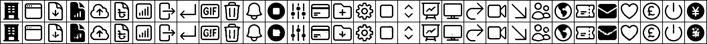

# Latent Space Exploration of Icons with a Variational Autoencoder

 VAE trained on Heroicon dataset to do arithmetic operations on their vector representations

## Reconstruction sampling
Epoch 6

Epoch 12

Epoch 36

Epoch 48

Epoch 50

## Random Generated vectors
Epoch 6

Epoch 12

Epoch 36

Epoch 50

## Latent Space Interpolation
Interpolating between two random points in the latent space shows smooth transitions between icon styles:

## Final Results
Final reconstructions and generated samples:

## Icon Arithmetic
Examples of vector arithmetic in the latent space:

### Icon Addition

### Icon Subtraction

### Icon Mean

### Icon Multiplication

### Icon Division

## Model Architecture
The VAE consists of an encoder and decoder with the following structure:
- Encoder: Convolutional layers (32→64→128→256)
- Latent dimension: 32
- Decoder: Transposed convolutions (256→128→64→32)

## Training Details
- Epochs: 50
- Batch size: 32
- Learning rate: 0.0001
- Beta (KL weight): 1.0
- Optimizer: Adam

